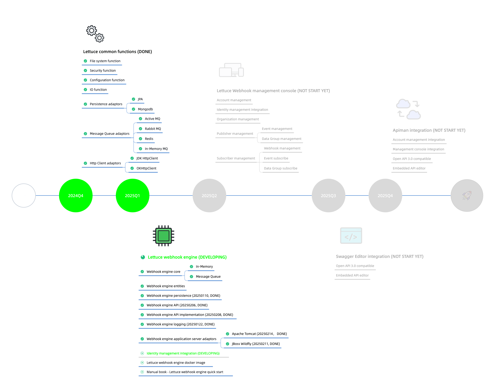

# Plants Soil - Lettuce

Most technical teams may always struggle in publishing API (data in) and subscribing external API (data out) for application integration, and spent lots of time and money on the communication & data transformation for both side.

Let's consider what should do for the application integration (A and B):

1. A meet B to communicate use cases, integration specification, agreement, etc.
2. Design API (endpoints, payloads / body, parameter, repsonse, error handling, security, etc.)
3. Develop API (architecture, programing language, web server, availability, scalability, etc)
4. Publish API (authentication, authorization, rate limit, whitelist, etc.)
5. Prepare and release API documentation
6. A meet B for tehnical clarification
7. A try to subscribe API from B, and B try to subscribe API from A
8. Go back to step 6 if any trouble, till anything goes well

This is just the beginning, more applications will make things mess.

**Plants Soil** is an Application Integration Solution, includes: API designer, Webhooks engine, API Gateway, Documentation publishing, Testing, etc.). **Plants Soil** try to make Application Integration from bi-direction to one-direction (Publisher and Subscriber), Publisher produces APIs and event-driven webhoohks, Subscriber consumes API and webhooks event. By this, it's also quite easy for Publisher to provide SDK (Partners could take this responsibility as well).

**Plants Soil** is construted on J2EE architecture and compliance to popular standards. In order to meet different requirements, decoupled into different parts. As the key of application integration, event-driven webhooks engine could be embedded or standalone, which named **Lettuce**.

---
## Use Cases

## Key Features

- Multi - Oganization (or Tenant)
- Multi - Data Group (or Merchant)
- Versioning
- Event Type Register
- Webhook Register
- Webhook Event Trigger
- Fail retry
- Logging
- Client App Register
- Client App Event Listener
- Access Token, Refresh Token

## Roadmap & Progress

## Contribute to Plants Soil
**Plants Soil** is open source, and we welcome anybody who wants to participate and contribute!

If you want to fix a bug or make any changes, please log an issue in [GitHub Issues](https://github.com/plants-soil/lettuce/issues) describing the bug or new feature.

You can <a href="mailto:danialdy@gmail.com?subject=Help Plants Soil&body=I%20need%20assistance with Lettuce.">email us</a>, if you want help, or to discuss a more complex issue.

